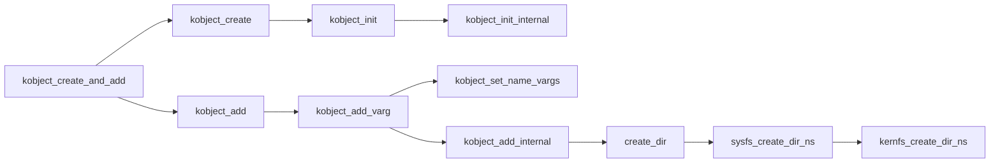

# 0x00 kobject

Linux的驱动模型中包含很多数据结构，比如device、device_drive等等，Linux需要管理这些数据结构，就把这些结构的共性抽象出来，用kobject组织起来，方便Linux进行管理

## -1- kobject数据结构

```c
//include/linux/kobject.h
struct kobject {
	const char		*name;                   // 该 kobject 在 sysfs 中呈现的文件/目录名称（ASCII 字符串）
	struct list_head	entry;               // 用于把 kobject 挂到 kset 或 parent 的 children 链表中的双向链表节点
	struct kobject		*parent;             // 指向父 kobject；在 sysfs 中表现为父目录
	struct kset		*kset;               // 指向该 kobject 所属的 kset；kset 本质上是“一类 kobject 的集合”
	struct kobj_type	*ktype;              // 定义一组对该类 kobject 通用的操作（release、sysfs 操作函数集等）
	struct kernfs_node	*sd;                 // 指向 sysfs 中对应的目录节点（struct kernfs_node 是 sysfs 内部表示）
	struct kref		kref;                // 引用计数，用于 kobject 生命周期管理，kobject_get/put 基于此实现
	unsigned int state_initialized:1;        // 标记是否已完成初始化（kobject_init 设置）
	unsigned int state_in_sysfs:1;           // 标记是否已注册到 sysfs（kobject_add 设置）
	unsigned int state_add_uevent_sent:1;    // 标记是否已发送 “add” 用户态事件（uevent）
	unsigned int state_remove_uevent_sent:1; // 标记是否已发送 “remove” 用户态事件（uevent）
	unsigned int uevent_suppress:1;          // 若置 1，则抑制所有 uevent 的产生（静默添加/删除）
};
```


## -2- kobject功能

1. 提供kref引用计数，方便管理对象的生命周期。当kref=0时，会自动调用ktype中的release函数释放对象
2. 提供entry链表节点，方便组织对象。
3. 提供parent指针，方便将对象组织成为有层次的树状结构（比如目录树）
4. 通过sysfs与文件系统结合，将对象的属性暴露到用户空间


## -3- kobject操作方法



```c
struct kobject *kobject_create_and_add(const char *name, struct kobject *parent)
{
	struct kobject *kobj;
	int retval;

	kobj = kobject_create();
	if (!kobj)
		return NULL;

	retval = kobject_add(kobj, parent, "%s", name);
	if (retval) {
		printk(KERN_WARNING "%s: kobject_add error: %d\n",
		       __func__, retval);
		kobject_put(kobj);
		kobj = NULL;
	}
	return kobj;
}
```

```c
struct kobject *kobject_create(void)
{
	struct kobject *kobj;

	kobj = kzalloc(sizeof(*kobj), GFP_KERNEL);//动态申请内存空间
	if (!kobj)
		return NULL;

	kobject_init(kobj, &dynamic_kobj_ktype);//create时自动初始化为dynamic_kobj_ktype类型
	return kobj;
}
```

```c
static struct kobj_type dynamic_kobj_ktype = {
	.release	= dynamic_kobj_release,
	.sysfs_ops	= &kobj_sysfs_ops,
};
```

```c
void kobject_init(struct kobject *kobj, struct kobj_type *ktype)
{
	char *err_str;

	if (!kobj) {
		err_str = "invalid kobject pointer!";
		goto error;
	}
	if (!ktype) {
		err_str = "must have a ktype to be initialized properly!\n";
		goto error;
	}
	if (kobj->state_initialized) {
		/* do not error out as sometimes we can recover */
		printk(KERN_ERR "kobject (%p): tried to init an initialized "
		       "object, something is seriously wrong.\n", kobj);
		dump_stack();
	}

	kobject_init_internal(kobj);//初始化引用次数等变量
	kobj->ktype = ktype;//初始化为传入的ktype
	return;

error:
	printk(KERN_ERR "kobject (%p): %s\n", kobj, err_str);
	dump_stack();
}
```

```c
static void kobject_init_internal(struct kobject *kobj)
{
	if (!kobj)
		return;
	kref_init(&kobj->kref);//原子化set kref=1
	INIT_LIST_HEAD(&kobj->entry);
	kobj->state_in_sysfs = 0;
	kobj->state_add_uevent_sent = 0;
	kobj->state_remove_uevent_sent = 0;
	kobj->state_initialized = 1;
}
```

```c
static inline void kref_init(struct kref *kref)
{
	atomic_set(&kref->refcount, 1);
}
```

```c
int kobject_add(struct kobject *kobj, struct kobject *parent,
		const char *fmt, ...)
{
	va_list args;
	int retval;

	if (!kobj)
		return -EINVAL;

	if (!kobj->state_initialized) {
		printk(KERN_ERR "kobject '%s' (%p): tried to add an "
		       "uninitialized object, something is seriously wrong.\n",
		       kobject_name(kobj), kobj);
		dump_stack();
		return -EINVAL;
	}
	va_start(args, fmt);
	retval = kobject_add_varg(kobj, parent, fmt, args);
	va_end(args);

	return retval;
}
```

```c
static int kobject_add_varg(struct kobject *kobj, struct kobject *parent,
			    const char *fmt, va_list vargs)
{
	int retval;

	retval = kobject_set_name_vargs(kobj, fmt, vargs);
	if (retval) {
		printk(KERN_ERR "kobject: can not set name properly!\n");
		return retval;
	}
	kobj->parent = parent;
	return kobject_add_internal(kobj);
}
```

```c
int kobject_set_name_vargs(struct kobject *kobj, const char *fmt,
				  va_list vargs)
{
	const char *old_name = kobj->name;
	char *s;

	if (kobj->name && !fmt)
		return 0;

	kobj->name = kvasprintf(GFP_KERNEL, fmt, vargs);
	if (!kobj->name) {
		kobj->name = old_name;
		return -ENOMEM;
	}

	/* ewww... some of these buggers have '/' in the name ... */
	while ((s = strchr(kobj->name, '/')))
		s[0] = '!';

	kfree(old_name);
	return 0;
}
```

```c
static int kobject_add_internal(struct kobject *kobj)
{
	int error = 0;
	struct kobject *parent;

	if (!kobj)
		return -ENOENT;

	if (!kobj->name || !kobj->name[0]) {
		WARN(1, "kobject: (%p): attempted to be registered with empty "
			 "name!\n", kobj);
		return -EINVAL;
	}

	parent = kobject_get(kobj->parent);

	/* join kset if set, use it as parent if we do not already have one */
	if (kobj->kset) {
		if (!parent)
			parent = kobject_get(&kobj->kset->kobj);
		kobj_kset_join(kobj);
		kobj->parent = parent;
	}

	pr_debug("kobject: '%s' (%p): %s: parent: '%s', set: '%s'\n",
		 kobject_name(kobj), kobj, __func__,
		 parent ? kobject_name(parent) : "<NULL>",
		 kobj->kset ? kobject_name(&kobj->kset->kobj) : "<NULL>");

	error = create_dir(kobj);
	if (error) {
		kobj_kset_leave(kobj);
		kobject_put(parent);
		kobj->parent = NULL;

		/* be noisy on error issues */
		if (error == -EEXIST)
			WARN(1, "%s failed for %s with "
			     "-EEXIST, don't try to register things with "
			     "the same name in the same directory.\n",
			     __func__, kobject_name(kobj));
		else
			WARN(1, "%s failed for %s (error: %d parent: %s)\n",
			     __func__, kobject_name(kobj), error,
			     parent ? kobject_name(parent) : "'none'");
	} else
		kobj->state_in_sysfs = 1;

	return error;
}
```

```c
static int create_dir(struct kobject *kobj)
{
	const struct kobj_ns_type_operations *ops;
	int error;

	error = sysfs_create_dir_ns(kobj, kobject_namespace(kobj));
	if (error)
		return error;

	error = populate_dir(kobj);
	if (error) {
		sysfs_remove_dir(kobj);
		return error;
	}

	/*
	 * @kobj->sd may be deleted by an ancestor going away.  Hold an
	 * extra reference so that it stays until @kobj is gone.
	 */
	sysfs_get(kobj->sd);

	/*
	 * If @kobj has ns_ops, its children need to be filtered based on
	 * their namespace tags.  Enable namespace support on @kobj->sd.
	 */
	ops = kobj_child_ns_ops(kobj);
	if (ops) {
		BUG_ON(ops->type <= KOBJ_NS_TYPE_NONE);
		BUG_ON(ops->type >= KOBJ_NS_TYPES);
		BUG_ON(!kobj_ns_type_registered(ops->type));

		sysfs_enable_ns(kobj->sd);
	}

	return 0;
}
```

```c
int sysfs_create_dir_ns(struct kobject *kobj, const void *ns)
{
	struct kernfs_node *parent, *kn;

	BUG_ON(!kobj);

	if (kobj->parent)
		parent = kobj->parent->sd;
	else
		parent = sysfs_root_kn;

	if (!parent)
		return -ENOENT;

	kn = kernfs_create_dir_ns(parent, kobject_name(kobj),
				  S_IRWXU | S_IRUGO | S_IXUGO, kobj, ns);
	if (IS_ERR(kn)) {
		if (PTR_ERR(kn) == -EEXIST)
			sysfs_warn_dup(parent, kobject_name(kobj));
		return PTR_ERR(kn);
	}

	kobj->sd = kn;
	return 0;
}
```

```c
struct kernfs_node *kernfs_create_dir_ns(struct kernfs_node *parent,
					 const char *name, umode_t mode,
					 void *priv, const void *ns)
{
	struct kernfs_node *kn;
	int rc;

	/* allocate */
	kn = kernfs_new_node(parent, name, mode | S_IFDIR, KERNFS_DIR);
	if (!kn)
		return ERR_PTR(-ENOMEM);

	kn->dir.root = parent->dir.root;
	kn->ns = ns;
	kn->priv = priv;

	/* link in */
	rc = kernfs_add_one(kn);
	if (!rc)
		return kn;

	kernfs_put(kn);
	return ERR_PTR(rc);
}
```


## 0x01 ktype

## -1- ktype数据结构

```c
struct kobj_type {
	void (*release)(struct kobject *kobj);
	const struct sysfs_ops *sysfs_ops;
	struct attribute **default_attrs;
	const struct kobj_ns_type_operations *(*child_ns_type)(struct kobject *kobj);
	const void *(*namespace)(struct kobject *kobj);
};
```

```c
struct sysfs_ops {
	ssize_t	(*show)(struct kobject *, struct attribute *, char *);
	ssize_t	(*store)(struct kobject *, struct attribute *, const char *, size_t);
};
```

```c
struct attribute {
	const char		*name;
	umode_t			mode;
};
```

```c
struct attribute_group {
	const char		*name;
	umode_t			(*is_visible)(struct kobject *,
					      struct attribute *, int);
	struct attribute	**attrs;
	struct bin_attribute	**bin_attrs;
};
```


## -2- ktype操作方法

```c
int sysfs_create_group(struct kobject *kobj,
		       const struct attribute_group *grp)
{
	return internal_create_group(kobj, 0, grp);
}
```

```c
static int internal_create_group(struct kobject *kobj, int update,
				 const struct attribute_group *grp)
{
	struct kernfs_node *kn;
	int error;

	BUG_ON(!kobj || (!update && !kobj->sd));

	/* Updates may happen before the object has been instantiated */
	if (unlikely(update && !kobj->sd))
		return -EINVAL;
	if (!grp->attrs && !grp->bin_attrs) {
		WARN(1, "sysfs: (bin_)attrs not set by subsystem for group: %s/%s\n",
			kobj->name, grp->name ?: "");
		return -EINVAL;
	}
	if (grp->name) {
		kn = kernfs_create_dir(kobj->sd, grp->name,
				       S_IRWXU | S_IRUGO | S_IXUGO, kobj);
		if (IS_ERR(kn)) {
			if (PTR_ERR(kn) == -EEXIST)
				sysfs_warn_dup(kobj->sd, grp->name);
			return PTR_ERR(kn);
		}
	} else
		kn = kobj->sd;
	kernfs_get(kn);
	error = create_files(kn, kobj, grp, update);
	if (error) {
		if (grp->name)
			kernfs_remove(kn);
	}
	kernfs_put(kn);
	return error;
}
```

```c
static int create_files(struct kernfs_node *parent, struct kobject *kobj,
			const struct attribute_group *grp, int update)
{
	struct attribute *const *attr;
	struct bin_attribute *const *bin_attr;
	int error = 0, i;

	if (grp->attrs) {
		for (i = 0, attr = grp->attrs; *attr && !error; i++, attr++) {
			umode_t mode = (*attr)->mode;

			/*
			 * In update mode, we're changing the permissions or
			 * visibility.  Do this by first removing then
			 * re-adding (if required) the file.
			 */
			if (update)
				kernfs_remove_by_name(parent, (*attr)->name);
			if (grp->is_visible) {
				mode = grp->is_visible(kobj, *attr, i);
				if (!mode)
					continue;
			}

			WARN(mode & ~(SYSFS_PREALLOC | 0664),
			     "Attribute %s: Invalid permissions 0%o\n",
			     (*attr)->name, mode);

			mode &= SYSFS_PREALLOC | 0664;
			error = sysfs_add_file_mode_ns(parent, *attr, false,
						       mode, NULL);
			if (unlikely(error))
				break;
		}
		if (error) {
			remove_files(parent, grp);
			goto exit;
		}
	}

	if (grp->bin_attrs) {
		for (bin_attr = grp->bin_attrs; *bin_attr; bin_attr++) {
			if (update)
				kernfs_remove_by_name(parent,
						(*bin_attr)->attr.name);
			error = sysfs_add_file_mode_ns(parent,
					&(*bin_attr)->attr, true,
					(*bin_attr)->attr.mode, NULL);
			if (error)
				break;
		}
		if (error)
			remove_files(parent, grp);
	}
exit:
	return error;
}
```

```c
int sysfs_add_file_mode_ns(struct kernfs_node *parent,
			   const struct attribute *attr, bool is_bin,
			   umode_t mode, const void *ns)
{
	struct lock_class_key *key = NULL;
	const struct kernfs_ops *ops;
	struct kernfs_node *kn;
	loff_t size;

	if (!is_bin) {
		struct kobject *kobj = parent->priv;
		const struct sysfs_ops *sysfs_ops = kobj->ktype->sysfs_ops;

		/* every kobject with an attribute needs a ktype assigned */
		if (WARN(!sysfs_ops, KERN_ERR
			 "missing sysfs attribute operations for kobject: %s\n",
			 kobject_name(kobj)))
			return -EINVAL;

		if (sysfs_ops->show && sysfs_ops->store) {
			if (mode & SYSFS_PREALLOC)
				ops = &sysfs_prealloc_kfops_rw;
			else
				ops = &sysfs_file_kfops_rw;
		} else if (sysfs_ops->show) {
			if (mode & SYSFS_PREALLOC)
				ops = &sysfs_prealloc_kfops_ro;
			else
				ops = &sysfs_file_kfops_ro;
		} else if (sysfs_ops->store) {
			if (mode & SYSFS_PREALLOC)
				ops = &sysfs_prealloc_kfops_wo;
			else
				ops = &sysfs_file_kfops_wo;
		} else
			ops = &sysfs_file_kfops_empty;

		size = PAGE_SIZE;
	} else {
		struct bin_attribute *battr = (void *)attr;

		if (battr->mmap)
			ops = &sysfs_bin_kfops_mmap;
		else if (battr->read && battr->write)
			ops = &sysfs_bin_kfops_rw;
		else if (battr->read)
			ops = &sysfs_bin_kfops_ro;
		else if (battr->write)
			ops = &sysfs_bin_kfops_wo;
		else
			ops = &sysfs_file_kfops_empty;

		size = battr->size;
	}

#ifdef CONFIG_DEBUG_LOCK_ALLOC
	if (!attr->ignore_lockdep)
		key = attr->key ?: (struct lock_class_key *)&attr->skey;
#endif
	kn = __kernfs_create_file(parent, attr->name, mode & 0777, size, ops,
				  (void *)attr, ns, key);
	if (IS_ERR(kn)) {
		if (PTR_ERR(kn) == -EEXIST)
			sysfs_warn_dup(parent, attr->name);
		return PTR_ERR(kn);
	}
	return 0;
}
```

```c
static const struct kernfs_ops sysfs_prealloc_kfops_rw = {
	.read		= sysfs_kf_read,
	.write		= sysfs_kf_write,
	.prealloc	= true,
};
```

```c
static ssize_t sysfs_kf_read(struct kernfs_open_file *of, char *buf,
			     size_t count, loff_t pos)
{
	const struct sysfs_ops *ops = sysfs_file_ops(of->kn);
	struct kobject *kobj = of->kn->parent->priv;

	/*
	 * If buf != of->prealloc_buf, we don't know how
	 * large it is, so cannot safely pass it to ->show
	 */
	if (pos || WARN_ON_ONCE(buf != of->prealloc_buf))
		return 0;
	return ops->show(kobj, of->kn->priv, buf);
}
```

```c
static ssize_t sysfs_kf_write(struct kernfs_open_file *of, char *buf,
			      size_t count, loff_t pos)
{
	const struct sysfs_ops *ops = sysfs_file_ops(of->kn);
	struct kobject *kobj = of->kn->parent->priv;

	if (!count)
		return 0;

	return ops->store(kobj, of->kn->priv, buf, count);
}
```

```c
struct kernfs_node *__kernfs_create_file(struct kernfs_node *parent,
					 const char *name,
					 umode_t mode, loff_t size,
					 const struct kernfs_ops *ops,
					 void *priv, const void *ns,
					 struct lock_class_key *key)
{
	struct kernfs_node *kn;
	unsigned flags;
	int rc;

	flags = KERNFS_FILE;

	kn = kernfs_new_node(parent, name, (mode & S_IALLUGO) | S_IFREG, flags);
	if (!kn)
		return ERR_PTR(-ENOMEM);

	kn->attr.ops = ops;
	kn->attr.size = size;
	kn->ns = ns;
	kn->priv = priv;

#ifdef CONFIG_DEBUG_LOCK_ALLOC
	if (key) {
		lockdep_init_map(&kn->dep_map, "s_active", key, 0);
		kn->flags |= KERNFS_LOCKDEP;
	}
#endif

	/*
	 * kn->attr.ops is accesible only while holding active ref.  We
	 * need to know whether some ops are implemented outside active
	 * ref.  Cache their existence in flags.
	 */
	if (ops->seq_show)
		kn->flags |= KERNFS_HAS_SEQ_SHOW;
	if (ops->mmap)
		kn->flags |= KERNFS_HAS_MMAP;

	rc = kernfs_add_one(kn);
	if (rc) {
		kernfs_put(kn);
		return ERR_PTR(rc);
	}
	return kn;
}
```

